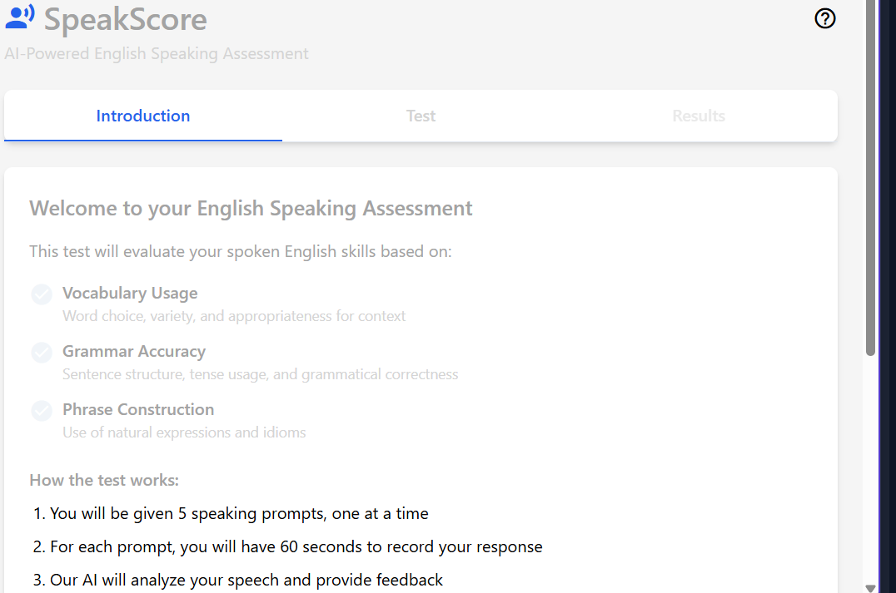

# SpeakScore - AI-Powered English Proficiency Assessment

SpeakScore is a comprehensive English speaking assessment application that evaluates users' language proficiency across multiple parameters: pronunciation, fluency, vocabulary usage, grammar accuracy, and active listening comprehension. The application aligns with CEFR standards (A1-C2) and provides detailed feedback with improvement suggestions.



## Features

- **Multiple Question Types**: Read-aloud passages, spontaneous responses, listening comprehension, role-play scenarios, and picture descriptions
- **Comprehensive Assessment**: Evaluation of vocabulary, grammar, pronunciation, fluency, and overall speaking ability
- **CEFR Alignment**: Results mapped to internationally recognized CEFR levels (A1-C2)
- **Adaptive Difficulty**: Progressive difficulty system (beginner, intermediate, advanced, expert)
- **Personalized Feedback**: Detailed strengths, improvement areas, and specific recommendations
- **Visual Progress Tracking**: Spider charts and performance metrics across different skills
- **Real-time Microphone Testing**: Built-in audio quality verification

## Technology Stack

- **Frontend**: React with TypeScript
- **Styling**: Tailwind CSS with shadcn/ui components
- **Backend**: Express.js (Node.js)
- **AI Integration**: Mistral AI for language assessment
- **Audio Processing**: AssemblyAI for speech transcription
- **State Management**: React Context API and TanStack Query

## Prerequisites

Before you begin, ensure you have the following installed:
- [Node.js](https://nodejs.org/) (v18.x or later)
- npm (v9.x or later, comes with Node.js)

## API Keys Required

This application requires the following API keys to function properly:
- **Mistral AI**: For language assessment ([Get a key here](https://mistral.ai/))
- **AssemblyAI**: For speech transcription ([Get a key here](https://www.assemblyai.com/))
- **OpenAI** (optional): For alternative language assessment ([Get a key here](https://openai.com/))

## Setup and Installation

### 1. Clone the Repository

```bash
git clone https://github.com/yourusername/speakscore.git
cd speakscore
```

### 2. Install Dependencies

```bash
npm install
```

### 3. Environment Setup

Create a `.env` file in the root directory with the following content:

```
MISTRAL_API_KEY=your_mistral_api_key
ASSEMBLYAI_API_KEY=your_assemblyai_api_key
OPENAI_API_KEY=your_openai_api_key  # Optional
```

Replace the placeholder values with your actual API keys.

### 4. Start the Development Server

```bash
npm run dev
```

This will start both the backend Express server and the frontend Vite development server. The application will be available at:

- **Frontend**: http://localhost:5000
- **Backend API**: http://localhost:5000/api

## Project Structure

```
speakscore/
├── client/                  # Frontend React application
│   ├── src/
│   │   ├── components/      # UI components
│   │   ├── context/         # React context providers
│   │   ├── hooks/           # Custom React hooks
│   │   ├── lib/             # Utility functions and API client
│   │   ├── pages/           # Page components
│   │   └── types/           # TypeScript type definitions
├── server/                  # Backend Express application
│   ├── assemblyai.ts        # AssemblyAI integration
│   ├── mistral.ts           # Mistral AI integration
│   ├── openai.ts            # OpenAI integration
│   ├── routes.ts            # API route definitions
│   ├── storage.ts           # Data storage implementation
│   └── vite.ts              # Vite server configuration
├── shared/                  # Shared code between client and server
│   └── schema.ts            # Database schema and type definitions
└── uploads/                 # Temporary storage for audio uploads
```

## Using the Application

1. **Introduction Tab**:
   - Select a difficulty level (beginner, intermediate, advanced, expert)
   - Review test instructions and click "Start Test"

2. **Test Tab**:
   - Respond to speaking prompts using your microphone
   - Follow the on-screen instructions for each prompt type
   - Use the record button to capture your response

3. **Results Tab**:
   - View your comprehensive assessment
   - Check your CEFR level and scores across different language skills
   - Review strengths, improvement areas, and recommendations

## Difficulty Levels

- **Beginner**: Basic communication skills (CEFR A1-A2)
- **Intermediate**: Everyday communication skills (CEFR B1)
- **Advanced**: Complex topic discussions (CEFR B2)
- **Expert**: Professional/academic fluency (CEFR C1-C2)

Users must score 80+ at their current level to unlock higher difficulty levels.

## Contributing

Contributions are welcome! Please feel free to submit a Pull Request.

## License

This project is licensed under the MIT License - see the LICENSE file for details.